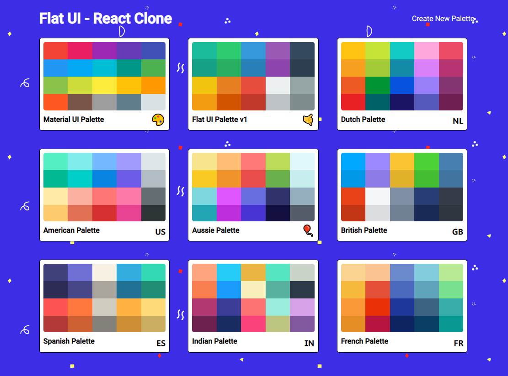
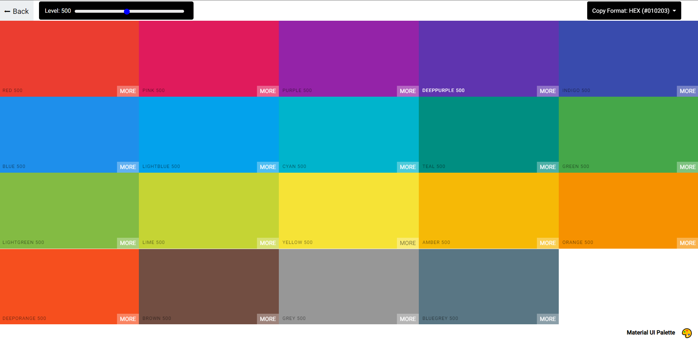
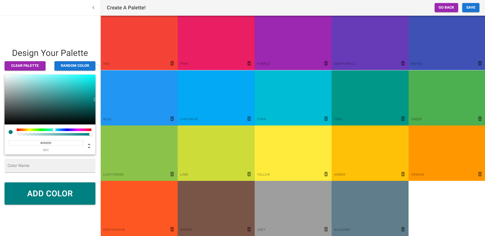

# React - Flat UI

A design and feature clone of the simple-yet-beatiful Flat UI website

View the live website at its [Github Page](https://epitome87.github.io/React-Flat-UI/)

## Overview

This is a fully-featured clone of the Flat UI website. It was designed based around the appearance / functionality of the Flat UI websie in the month of November, 2021. It includes all the features found on the actual website, other than audio playing. Extra features were also added, such as the ability for the user to create and save their own custom palettes. Some qualify-of-life changes were also made, such as detecting the contrast of text against a colored backdground and changing that text's color dynamically in order to be more readable, as well as a brightness slider to view colors at 10 different shades.

## Tech Stack / Packages

- React
- React Router (v6)
- Material UI
- React Transition Group (for transitions between routes)
- React Color (for user color pickers)
- Chroma.js (for color conversions / utilities)

## Features

### View Premade Palettes

Browse from a handful of pre-made color palettes. You can click an individual color and automatically copy its value (based on a desired output -- including RGB, RGBA, and Hex). There is also a slider to view the color palette at 10 different brightness levels.

### Create a Custom Palette

The user can create, edit, delete, and save their own unique color palettes! They can name the palette and select an emoji to represent it, and that palette will be locally stored and ready to view the next time they visit the site.

## Future Plans

Although this project was initially meant to be a simple clone of Flat UI, perhaps backend-functionality will be added to it. This might include the ability for users to login, share their own color palettes, and comment on those by other creators.
